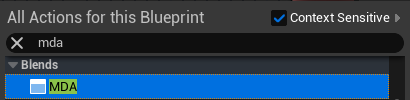
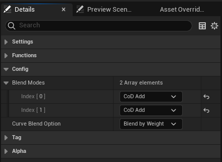
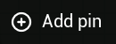
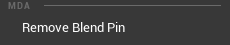

# MDA  

## What's this
MDA is a plugin of Unreal Engine that provides an animation blueprint node for using additive animations.

## What's special
As described in the label of [Mode](#mode), it is suitable for the additive animations from `Call of Duty` titles.

## Mode
* Add  
  `Location`: BasePose + AdditivePose  
  `Rotation`: BasePose * AdditivePose

* Subtract  
  `Location`: BasePose - AdditivePose  
  `Rotation`: BasePose / AdditivePose

* CoD Add  
  `Location`: BasePose + AdditivePose - ReferencePose  
  `Rotation`: BasePose * AdditivePose

## How to use
* Create new nodes:  
Search for `MDA` in Animation Blueprint.  

* Change the modes of layers:  
Options of the modes can be found in the node details panel.  

* Add new layer pins:  
Click the button named `Add pin` of the node.  

* Remove layer pins:  
Right-click the layer pin and click the Remove button.  

